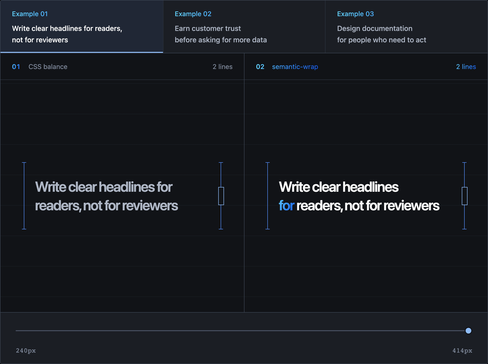

<div align="center">
  
  <br />
  <p>
    <a href="https://www.npmjs.com/package/@semantic-wrap/core"></a>
    <a href="https://www.npmjs.com/package/@semantic-wrap/core"></a>
    <a href="https://github.com/woohyun-park/semantic-wrap"></a>
    <a href="https://github.com/woohyun-park/semantic-wrap/blob/main/LICENSE"></a>
  </p>
  <p>English | <a href="./README-ko_kr.md">한국어</a></p>
</div>

## What is semantic-wrap?

`semantic-wrap` is a language-independent JavaScript library that selects line breaks from a
trained model and the actual rendered layout. It compares model-predicted boundaries with the
browser's native wrapping and inserts `<br>` elements when the calculated layout is selected.
Both the model and the selection strategy are replaceable, and experimental presets are
available for English and Korean titles. The project began as an attempt to reproduce the line
breaks that feel natural when reading Korean text.

## Playground

<a href="https://semantic-wrap.woohyunpark.xyz/#playground">
  
</a>

## Examples

| Browser native wrapping | semantic-wrap |
| --- | --- |
| Strong teams disagree openly while<br>keeping the shared goal visible | Strong teams disagree openly<br>while keeping the shared goal visible |
| Before adding another<br>feature, understand the<br>behavior it should change | Before adding another feature,<br>understand the behavior<br>it should change |
| The best design systems<br>create consistency without<br>blocking local needs | The best design systems<br>create consistency<br>without blocking local needs |
| Security decisions work better when<br>they begin during product design | Security decisions work better<br>when they begin during product design |

## Quick start

Install all three packages to use the English preset with React.

```sh
npm install @semantic-wrap/core @semantic-wrap/react @semantic-wrap/en react react-dom
```

React and React DOM 19 or later are required by `@semantic-wrap/react`. Projects that use
only the core or a model do not need React.

All three packages are ESM-only.

```tsx
import { enTitleModel } from "@semantic-wrap/en";
import { SemanticWrap } from "@semantic-wrap/react";

export function Title({ children }: { children: string }) {
  return (
    <SemanticWrap model={enTitleModel}>
      <h1 className="title">{children}</h1>
    </SemanticWrap>
  );
}
```

`SemanticWrap` preserves its child element and adds no wrapper. Precise mode is the default:
it keeps SSR text in the HTML, holds it at zero opacity until the first exact selection is
ready, and then renders the result. Progressive mode leaves SSR text completely untouched
and starts precise selection on the first viewport or element resize.

## Packages

| Package | Purpose |
| --- | --- |
| `@semantic-wrap/core` | Boundary prediction, candidate aggregation, layout calculation, and selection |
| `@semantic-wrap/react` | React integration for DOM measurement and `<br>` rendering |
| `@semantic-wrap/en` | Experimental phrase model for English titles |
| `@semantic-wrap/ko` | Experimental phrase model for Korean titles |

## How it works

1. A phrase model predicts line-break boundaries and assigns a cost to each one.
2. Core aggregates the predictions and calculates multiple layout candidates at the actual
   font and width.
3. Core requires stronger model support before replacing a fitting native layout, then uses
   visual balance to select the final result.
4. When a calculated layout is selected, the React package renders `<br>` elements.
   Otherwise, it leaves the source text unchanged and lets the browser wrap it.

The React package measures again when the element is resized, its class or inline style
changes, or its web fonts finish loading, so it works with responsive layouts.

## Core API

### `selectLineBreaks(input, options?)`

`selectLineBreaks` runs the complete prediction-to-selection pipeline without depending on
React or the DOM.

Required `input`:

| Field | Type | Description |
| --- | --- | --- |
| `text` | `string` | Source text to wrap |
| `model` | `PhraseModel` | Model that predicts boundaries and their priorities |
| `maxWidth` | `number` | Maximum width available to one line |
| `measureText` | `(text: string) => number` | Measures a string with the target font and returns its width |

Optional `options`:

| Field | Type | Default | Description |
| --- | --- | --- | --- |
| `nativeLayout` | `BaselineLayout` | none | Existing line breaks to compare, expressed as ascending UTF-16 offsets |
| `strategy` | `LineBreakStrategy` | default strategy | Overrides prediction aggregation, layout-candidate calculation, or final selection |
| `diagnostics` | `boolean` | `false` | Includes intermediate pipeline results in the return value |

```ts
import { selectLineBreaks } from "@semantic-wrap/core";
import { enTitleModel } from "@semantic-wrap/en";

const canvas = document.createElement("canvas");
const canvasContext = canvas.getContext("2d")!;
canvasContext.font = "700 28px system-ui";

const result = selectLineBreaks({
  text: "Write headlines for readers not for internal approval",
  model: enTitleModel,
  maxWidth: 420,
  measureText: (text) => canvasContext.measureText(text).width,
});

console.log(result.lines);
// ["Write headlines for readers", "not for internal approval"]
```

Output: `LineBreakSelection`

| Field | Type | Description |
| --- | --- | --- |
| `text` | `string` | Original input text |
| `lines` | `string[]` | Text split at the selected boundaries |
| `breaks` | `number[]` | Ascending UTF-16 offsets at which each line except the last ends |
| `widths` | `number[]` | Width of each line returned by `measureText` |
| `selectedCandidates` | `BreakCandidate[]` | Aggregated model candidates used by the selected layout |
| `applied` | `boolean` | Whether the calculated breaks should be rendered |
| `reason` | `string` | Reason returned by the selection stage |
| `overflow` | `boolean` | Whether any selected line exceeds `maxWidth` |
| `diagnostics` | `LineBreakDiagnostics` | Included only when `diagnostics: true` |

When `nativeLayout` is provided, Core evaluates it together with the calculated layouts. If
it is omitted, Core selects only from the calculated layouts. `SemanticWrap` and
`useSemanticWrap` measure the browser's actual wrapping and provide it automatically. The
default selector can replace an overflowing native layout with any fitting calculated
layout. Otherwise, replacement requires the same line count and a lower `modelCost`.

### `createLineBreakPlan(input)`

Create a lazy plan when the same text, model, and strategy will be measured repeatedly:

```ts
const plan = createLineBreakPlan({ text, model, strategy });

plan.predict();
plan.aggregate();
plan.calculate({ maxWidth, measureText });
plan.select({ maxWidth, measureText, nativeLayout });
```

Calling a later stage runs its prerequisites. Prediction and aggregation are cached as
immutable snapshots, while calculation and selection run for each measurement.

### Custom phrase models

`selectLineBreaks` accepts any model that implements `PhraseModel`. Replace `enTitleModel`
with an independently trained model, or provide multiple models as `levels` so their
predictions can be aggregated together.

| Field | Required | Default | Description |
| --- | --- | --- | --- |
| `levels` | yes | — | One or more models and their relative `penalty` values |
| `fallbackPenalty` | yes | — | Cost of an allowed boundary not predicted by any level |
| `boundaryMode` | no | `"spaces"` | `"spaces"` uses whitespace boundaries; `"characters"` uses Unicode grapheme boundaries and merges each adjacent whitespace run into one boundary |

Each level's `penalty` is the cost of breaking at a boundary predicted by that model. Lower
values are preferred during layout calculation. If multiple levels predict the same
boundary, the default aggregation stage keeps the lowest penalty.

This example creates a model that prefers the whitespace boundary after a colon:

```ts
import { selectLineBreaks, type PhraseModel } from "@semantic-wrap/core";

const canvasContext = document.createElement("canvas").getContext("2d")!;
canvasContext.font = "700 28px system-ui";

const colonTitleModel: PhraseModel = {
  boundaryMode: "spaces",
  levels: [
    {
      name: "after-colon",
      model: { UW3: { ":": 100 } },
      penalty: 0,
    },
  ],
  fallbackPenalty: 1,
};

const result = selectLineBreaks({
  text: "Design review checklist: what to ask before approval",
  model: colonTitleModel,
  maxWidth: 400,
  measureText: (value) => canvasContext.measureText(value).width,
});

console.log(result.lines);
// ["Design review checklist:", "what to ask before approval"]
```

`UW3` is the BudouX feature for the character immediately before a boundary. The value
`100` is a feature weight used by BudouX when classifying that boundary, not a probability.

### Strategies

The default strategy is built from three replaceable stages.

| Stage | Default | Customization examples |
| --- | --- | --- |
| `aggregate` | `lowestPenalty()` | Require agreement across model levels with `consensus()` |
| `calculate` | `optimalLayouts()` | Use `greedy()` or implement line-count and forbidden-boundary rules |
| `select` | `balance()` | Require lower model cost before replacing native, then apply visual balance |

`calculate` returns `LineBreakLayoutCandidate[]`. Each candidate has the shape `{ breaks }`.
Core measures those candidates as `LineBreakLayout` values and passes them to `select`
together with `nativeLayout`.

```ts
import {
  balance,
  consensus,
  createLineBreakStrategy,
  greedy,
} from "@semantic-wrap/core";

const strategy = createLineBreakStrategy({
  aggregate: consensus({ minimumModels: 2 }),
  calculate: greedy(),
  select: balance({ tolerance: 0.12 }),
});

const result = selectLineBreaks(input, { strategy, diagnostics: true });
```

Omitted stages use their defaults. `optimalLayouts()` returns the non-dominated,
minimum-line candidates across visual balance and model cost. `balance()` evaluates those
candidates together with `nativeLayout`; its default tolerance is `0.12`.

When native fits, `balance()` only considers non-overflowing candidates with the same line
count and a lower `modelCost`. It keeps native if the model provides no improvement. Visual
balance then decides whether an improved candidate is still acceptable. If native overflows,
any fitting calculated layout may replace it. Without `nativeLayout`, selection proceeds
among the calculated layouts as usual.

The following strategy replaces only `calculate`. It still creates a two-line title but
rejects candidates that would leave a single word on the last line.

```ts
import {
  createLineBreakStrategy,
  selectLineBreaks,
  type LineBreakCalculator,
} from "@semantic-wrap/core";
import { enTitleModel } from "@semantic-wrap/en";

const canvasContext = document.createElement("canvas").getContext("2d")!;
canvasContext.font = "700 28px system-ui";

const twoLineTitleCalculator: LineBreakCalculator = ({
  text,
  candidates,
  maxWidth,
  measureText,
}) => {
  let best: { offset: number; score: number } | undefined;

  for (const candidate of candidates) {
    const firstLine = text.slice(0, candidate.offset).trimEnd();
    const lastLine = text.slice(candidate.offset).trimStart();
    const firstWidth = measureText(firstLine);
    const lastWidth = measureText(lastLine);

    if (firstWidth > maxWidth || lastWidth > maxWidth) continue;
    if (lastLine.split(/\s+/u).length < 2) continue;

    const imbalance = Math.abs(firstWidth - lastWidth) / maxWidth;
    const score = candidate.penalty + imbalance;
    if (!best || score < best.score) best = { offset: candidate.offset, score };
  }

  return [{ breaks: best ? [best.offset] : [] }];
};

const customStrategy = createLineBreakStrategy({
  calculate: twoLineTitleCalculator,
});
const input = {
  text: "Good metrics guide decisions before they become dashboard decoration",
  model: enTitleModel,
  maxWidth: 600,
  measureText: (value: string) => canvasContext.measureText(value).width,
};

console.log(selectLineBreaks(input).lines);
// ["Good metrics guide decisions before", "they become dashboard decoration"]

console.log(selectLineBreaks(input, { strategy: customStrategy }).lines);
// ["Good metrics guide decisions", "before they become dashboard decoration"]
```

### Diagnostics

Enable diagnostics when tuning aggregation rules or investigating a result.

```ts
const result = selectLineBreaks(input, { diagnostics: true });

console.log(result.diagnostics.predictions);
console.log(result.diagnostics.candidates);
```

| Field | Description |
| --- | --- |
| `predictions` | Raw boundaries predicted by each model level; an offset may appear more than once |
| `candidates` | One candidate list produced by `aggregate` |
| `calculatedLayouts` | Measured layouts produced by `calculate`, including line count, balance, model cost, and overflow |
| `nativeLayout` | Measured browser layout when supplied |
| `selection` | Source, index, and reason returned by `select` |

The default `balance()` selector uses `native-no-model-improvement` when no calculated
layout has lower model cost. Its other reasons are `native-selected` and
`calculated-selected`. A custom selector may return its own reason.

## React API

### `SemanticWrap`

Wrap the styled element when using Chakra UI or Tailwind CSS.

`SemanticWrap` accepts one plain-text React element that forwards its ref to an actual
`HTMLElement`.

| Prop | Required | Default | Description |
| --- | --- | --- | --- |
| `children` | yes | — | One plain-text React element |
| `model` | yes | — | Phrase model used to create boundary candidates |
| `strategy` | no | default strategy | Aggregation, calculation, and selection rules |
| `mode` | no | `"precise"` | `"precise"` waits for the exact first layout; `"progressive"` shows native SSR and activates precise selection on the first viewport or element resize |
| `ref` | no | — | `HTMLElement` ref shared with the child |

```tsx
<SemanticWrap mode="progressive" model={enTitleModel}>
  <h1>{title}</h1>
</SemanticWrap>
```

Both modes measure in an invisible DOM copy and synchronously commit the final result from
the resize observer. The visible element is never cleared or changed to raw text for
measurement.

#### Chakra UI

```tsx
import { Text } from "@chakra-ui/react";
import { enTitleModel } from "@semantic-wrap/en";
import { SemanticWrap } from "@semantic-wrap/react";

<SemanticWrap model={enTitleModel}>
  <Text textStyle="heading2">{title}</Text>
</SemanticWrap>
```

#### Tailwind CSS

```tsx
import { createLineBreakStrategy, greedy } from "@semantic-wrap/core";
import { enTitleModel } from "@semantic-wrap/en";
import { SemanticWrap } from "@semantic-wrap/react";

const greedyStrategy = createLineBreakStrategy({ calculate: greedy() });

<SemanticWrap model={enTitleModel} strategy={greedyStrategy}>
  <h2 className="text-3xl font-bold leading-tight">{title}</h2>
</SemanticWrap>
```

### `useSemanticWrap`

Use the hook when your application needs to render the selected lines itself or inspect
diagnostics. Measurement uses the target element's computed text style. If nested markup
uses different typography, call Core with a matching custom `measureText` function instead.

```tsx
import { enTitleModel } from "@semantic-wrap/en";
import { useSemanticWrap } from "@semantic-wrap/react";

export function BreakPreview({ title }: { title: string }) {
  const { ref, selection } = useSemanticWrap({
    text: title,
    model: enTitleModel,
  });
  const preview = selection ? selection.lines.join(" / ") : title;

  return <h1 ref={ref}>{preview}</h1>;
}
```

Options:

| Field | Required | Default | Description |
| --- | --- | --- | --- |
| `text` | yes | — | Source text to measure and split |
| `model` | yes | — | Phrase model used to create boundary candidates |
| `strategy` | no | default strategy | Aggregation, calculation, and selection rules |
| `diagnostics` | no | `false` | Whether to include intermediate pipeline results |

Output: `UseSemanticWrapResult`

| Field | Type | Description |
| --- | --- | --- |
| `ref` | `(element: HTMLElement \| null) => void` | Callback ref for the measured element |
| `selection` | `LineBreakSelection \| null` | `null` before measurement; otherwise the selected result |
| `diagnostics` | `LineBreakDiagnostics \| null` | `null` unless requested and measurement has completed |

The hook does not alter the target element's children or CSS.

## Preset status

> [!WARNING]
> `@semantic-wrap/en` and `@semantic-wrap/ko` are experimental presets trained on small
> datasets. For higher accuracy, use a model trained and validated on a large dataset
> representative of your production environment. See the
> [English Model Card](./packages/en/MODEL_CARD.md) and
> [Korean Model Card](./packages/ko/MODEL_CARD.md) for details.

## Development

```sh
bun install
bun run check
```

`bun run check` runs type checking, unit tests, the build, Chromium, Firefox, and WebKit
browser tests, and npm package validation.

## Release

Add a Changeset for every package-facing change.

```sh
bun changeset
```

Merging to `main` creates or updates one version pull request. Merging that pull request
publishes all four fixed-version packages through npm trusted publishing, creates the package
git tags and a unified GitHub Release, then verifies that npm, git, and GitHub all report the
same version. See [RELEASING.md](./RELEASING.md) for the one-time repository setup.

## License

Apache-2.0. `@semantic-wrap/core` includes a modified, dependency-free implementation of the
Google BudouX parser. See [NOTICE](./NOTICE) for details.
